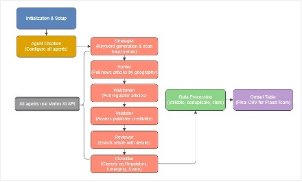

# Fraud Intelligence Pipeline (ScamWatch)

Proof-of-concept AI fraud intelligence pipeline built on **Google Cloud Platform** with **Vertex AI** (Gemini 3 Pro). The tool ingests public signals—regulators, reputable news, and industry sources—to surface emerging fraud themes, enrich articles with structured fields, screen publisher credibility, and classify risk for Canadian banking context.

**Authors:** Mohammad Valizadehmoghadam and Brendan Wimsatt  
**Affiliation:** University of Toronto — Rotman School of Management, Master of Financial Risk Management  
**Timeline:** ~10 weeks of development; public summary dated March 2026  

The project was completed in collaboration with a major Canadian financial institution under NDA. This repository holds the **public portfolio summary**; certain organizational details are omitted per confidentiality obligations.

## At a glance

- **The problem:** Emerging fraud shows up across many sites; teams need **timely discovery** plus **confidence the source is credible**, not a pile of unvetted links.
- **What we did:** **Vertex AI (Gemini)** on GCP runs **six agents in sequence**—find trends, gather articles from media and regulators, validate sources, enrich fields, then classify (**Regulatory / Emerging / Scam**).
- **The result:** A **single CSV per run** (about 45 minutes end-to-end in the PoC) that packages intelligence for fraud teams; see the [workflow diagram](#pipeline-overview) and [full report](ScamWatch_Public_Summary.pdf) for detail.

## Public report

Full narrative, limitations, and appendices are in [`ScamWatch_Public_Summary.pdf`](ScamWatch_Public_Summary.pdf).

## Objectives

- **Discovery and classification** of emerging fraud risks (target: roughly 20–30 useful, reputable articles per run where possible).
- **Source credibility** assessment alongside content relevance.
- Long-term vision: recurring, automated intelligence tailored to the Canadian banking sector.

Core implementation used **Jupyter Notebook Workbench** on GCP with the **Vertex AI API** and **Vertex AI Studio** for prompt engineering and development support.

## Pipeline overview

1. **Strategist** — Refreshes trending fraud keywords (five search vectors) on each run using Google Search grounding; higher temperature at this stage to broaden discovery.
2. **Hunter** — Retrieves articles from news, law firms, and industry sources across six regions (Canada, USA, UK, Australia, Europe, East Asia); typically 6–8 articles per jurisdiction (configurable).
3. **Watchman** — Same Strategist-driven queries, constrained to a fixed set of regulators and government affiliates across eight jurisdictions (17 predefined sources).
4. **Validator** — Scores publisher reputability; articles below the threshold (50/100 in the PoC) are dropped. Production would combine this with Fact Check and traffic signals (see report).
5. **Reviewer** — Fills structured fields: bank relevance, jurisdiction, industry, fraud type, summary, modus operandi, optional loss and legal status when explicitly reported.
6. **Classifier** — Assigns **Regulatory**, **Emerging**, or **Scam** using fraud-team definitions, with confidence and reasoning.

**Pilot agents not retained:** the Scorer (too discretionary) and the Historian (unreliable “first occurrence” retrieval).

Runs use a **rolling window** derived from prior CSV filenames, bounded between **7 and 30 days** to balance coverage and LLM load. Output is a **deduplicated CSV** of enriched articles.

## Feasibility and constraints

The PoC demonstrated an end-to-end run in **about 45 minutes**, including dynamic keywords, multi-jurisdiction sourcing, enrichment, credibility filtering, deduplication, and classification.

**Sandbox limitations** (as documented in the report) included restricted export, no direct article URLs (workaround: Google Search links from title + date), and no production APIs (e.g. Custom Search, Fact Check Tools, PageSpeed Insights). Moving outside the sandbox would unlock the recommended API-backed credibility and URL accuracy improvements.

## Disclaimer

This README summarizes the public portfolio document only. It is not financial or security advice and does not disclose confidential partner material.
